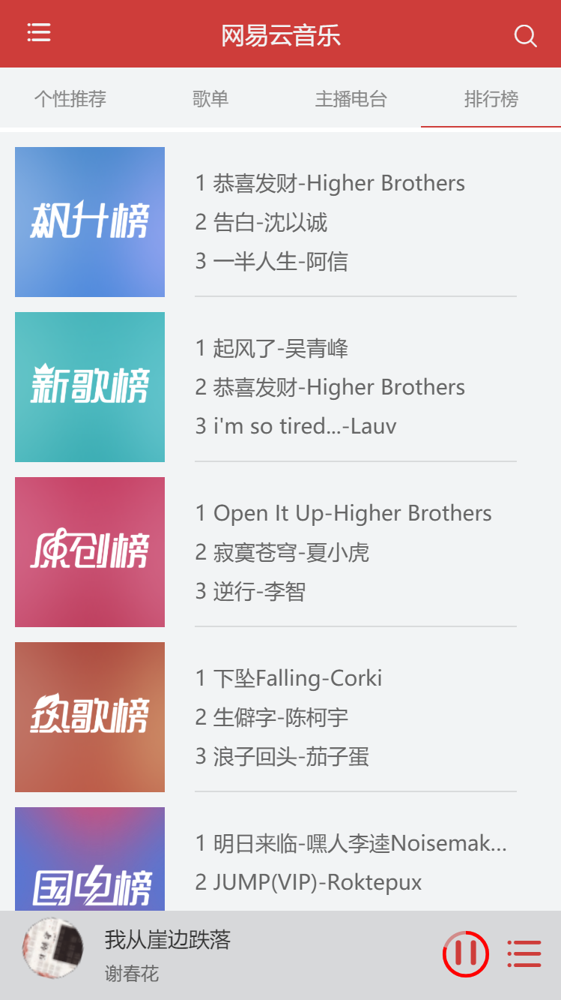
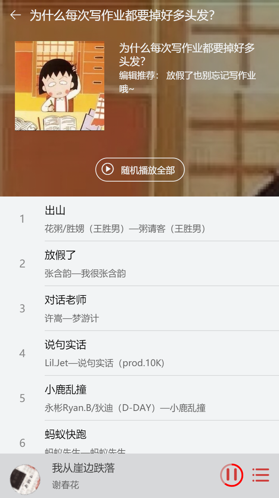
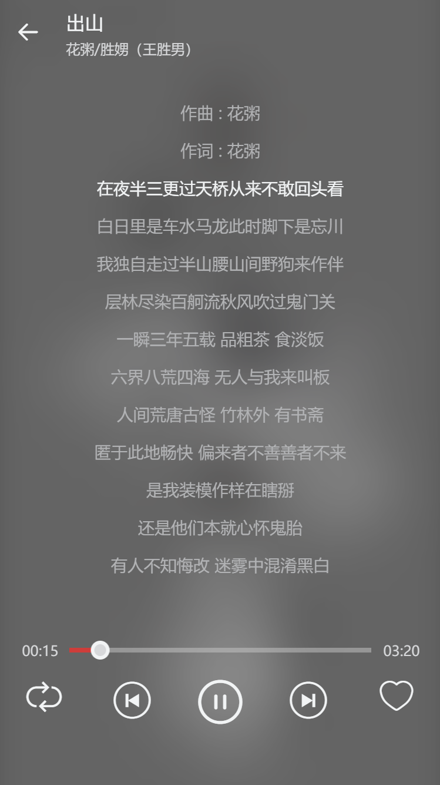
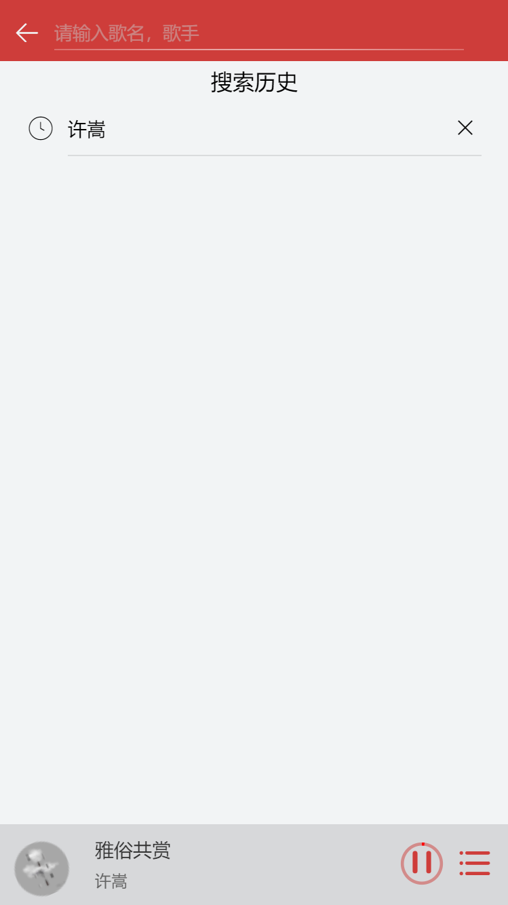

Welcome to 王小白!
===================

后期需要重新做，以前学习vue的时候写的，很多地方都不知道什么意思和什么意义了

# 高仿网易云播放器
>- 除了后端的歌曲获取是直接搜索网上的API，算是半高仿吧
>- 先线上访问一下看下效果吧：[项目地址](http://www.qhyking.com)  **使用chrome的手机调试模式效果更佳**
>- 手机直接扫二维码


## 技术栈

>- 传说中的VUE全家桶(vue-cli   vue   vue-router   vuex)
>- vue的组件开发，减少了很多代码的冗余
>- http使用的是axios
>- css使用的是less


## 目标功能

- [x] 首页
- [x] 歌单列表
- [x] 歌单详情
- [x] 排行榜
- [x] 歌曲播放
- [x] 歌词播放
- [x] 歌曲快进
- [x] 播放历史记录
- [x] 播放列表
- [x] 搜索
- [x] 搜索历史
- [ ] 我喜欢的

效果图








## 鸣谢

此网站提供的API: [网易音乐API](https://binaryify.github.io/NeteaseCloudMusicApi/#/) ,此接口的说明请到这里查看

##安装运行（Build Setup）

``` bash
# 初始化文件夹
git init

# 克隆git仓库
git clone git@github.com:zxcvb2850/my_music.git

# 安装所需的包
npm install

# 运行vue的项目 默认监听端口localhost:9000
npm run dev

# 打包vue项目
npm run build

```
**由于我使用的是网易云音乐的API是很牛很牛的大佬 [ Binaryify](https://github.com/Binaryify/NeteaseCloudMusicApi) 提供。所以还需要自己手动开启数据获取**


## 再次非常感谢[网易音乐API](https://github.com/Binaryify/NeteaseCloudMusicApi) 的大佬对接口文档的不断维护与更新。
